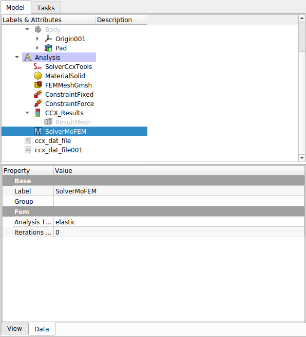

# solver.py

According to wiki page the `solver.py` script is to:  
**\[Create a\] document object visible in the tree-view.**  

**\[It is\] implemented in python via a document \[Class\] proxy and \[Class\] view proxy.**  

The `View` class defines the properties available to the user to modify, as shown by the Property/Value table in the image above.

